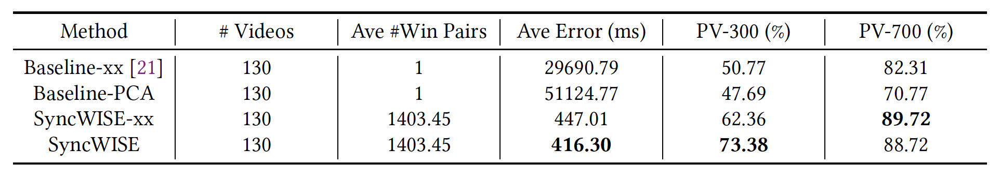

# Time Sync Study

This is the project repository website for UCLA ECE 209 AS-2 Winter 2021 supervised by Prof. Mani B. Srivastava. The project will focus on exploring state-of-the-art methods which try to mitigate faulty time stamps on multimodal data, evaluating them using different metrics, and trying to propose new methods based on them to improve the performance.

Time Shifts in Multimodal Data from SyncWISE Paper

------
# Background and Goals
Multi-modality sensors offer a wider insight into understanding complex behaviors. For example, recognizing human activities such as differentiating washing hands or walking using more than one type of sensors. However, there is a challenge in lining up the data to a reference point. It may be possible one sensor has timestamps relatively faster or slower than a reference point. This issue of misaligned timestamps present challenges to deep learning models that use more than one input. During training, the model would have a hard time learning features as features corresponding to one activity leaks into another. 

Some works try to tackle the issue of misalignment through several ways. Some try to fix the source of the problem and minimize the error by enforcing synchronization at the hardware or software level during capture. Some exploit the cross-correlation of the data from different sensors to predict and correct the time shifts before using them further. Other works have focused on training deep learning models that can be robust to bad timestamps using data augmentation techniques.

This project will focus on the cross-correlation-based and deep-learning-based methods. Specifically, we will explore and investigate two state-of-the-art works “SyncWISE” and “Time Awareness”.

### Basic Objectives
- Explore the range of shifts that can be handled by each component
- Explore to combine SyncWISE and Time Awareness and evaluate the performance

### Future Objectives
- Propose new methods with these two works as foundations for better performance measured on different metrics

------
# Approach
## Measuring Contribution
Though SyncWISE and Time Awareness try to handle similar time synchronization errors across multimodal data, they have different specific goals, generate different kinds of outputs, and use different metrics to evaluate their methods. Therefore, to measure their effectivness, we need to evaluate both contributions individually. Finally, we will combine both methods to see if further improvement can be gained.

Window Induced Shift Estimation method for Synchronization (SyncWISE) mainly aims to synchronize video data with adjacent sensor streams, which can enable temporal alignment of video-derived labels to diverse wearable sensor signals. It uses cross-correlation to match multimodal data to the offsets. The output is the time shifts between video and other sensor data. SyncWISE uses two metrics to evaluate performance: 

1. The average of the absolute value of the synchronization error, $Eavg$.
2. The percentage of clips which are synchronized to an offset error of less than $n$ ms, $Pv-n$. 

Time Awareness tries to use the data directly instead of aligning them. It induces time synchronization errors during training to improve the model's robustness. They add artificial shifts in the dataset and check the model's test accuracies to evaluate the effectiveness. 

Here, we will evaluate four combinations to understand the effectiveness of each work. The details of training and testing of these three approaches are shown below. We will use the same original model architecture and dataset if possible.

Approach Baseline (NO SyncWISE + Time Awareness Non-Robust): 
- Training + Validation WITHOUT data augmentation (domain randomization) of shifted data
- Testing: Introduce artificial shifts in test data, WITHOUT SyncWISE correction, and then feed to classifier

Approach 2 (NO SyncWise + Time Awareness Robust):
- Training + Validation WITH data augmentation (domain randomization) of shifted data
  - Expand the training and validation data with additional copies that have random shifts
- Testing: introduce artificial shifts in test data, WITHOUT SyncWISE correction, and then feed to classifier
  - The classifier here is to show the effects of shifted data augmentation

Approach 3 (SyncWISE + Time Awareness Non-Robust): 
- Training + Validation WITHOUT data augmentation (domain randomization) of shifted data
- Testing: Introduce artificial shifts in test data, WITH SyncWISE correction, and then feed to classifier
  - The classifier here is to show the effects of SyncWISE
  - Also try to run another cross-correlation based approach (baseline method in SyncWISE paper)

Approach 4 (SyncWISE + TimeAwareness Robust):
- Training + Validation with data augmentation (domain randomization) of shifted data
- Testing: introduce artificial shifts in test data, WITH SyncWISE correction, and then feed to classifier

## Exploring the Dataset
Time Awareness uses the CMActivity dataset which contains 3 different sensor modalities. These modalities are video, audio, and inertial measurement units (IMU). Here we mainly focus on video and IMU data, because sound data here is not time series instead they are the extracted features like MFCC and power spectrogram. In this dataset, there are 7 human activities roughly distributed equally: Go Upstairs, Go Downstairs, Walk, Run, Jump, Wash Hand, Jumping Jack. There are roughly 11,976 train+validate samples and 1,377 test samples total. The size of each video series is (45, 64, 64, 3), where 45 is the number of frames and 64\*64\*3 is the size of each frame. The size of each IMU series is (40, 12), consisting of 40 samples from 4 sensors (acc_right gyro_right acc_left gyro_left) where each sensor has three directions. Here are the video and IMU example:

It is assumed that the CMActvity dataset does not have any time shifts and so we will need to generate fake shifts ourselves. To do this, we pick the IMU modality to be shifted. To generate shifted samples, we first rearrange the samples into a long sequence. Inside the sequence contains windows of the activities of roughly 10 seconds. Then we shift the IMU samples. For the CMActivity dataset, we generated shifts ranging from 50ms to 2000ms.

SyncWISE uses the CMU-MMAC dataset which contains 2 sensor modalities. These modalities are video and inertial measurement units. There are a total of 163 videos representing 45.2 hours of data, averaging 998.28s per clip. The dataset is augmented by adding random offsets in the range [-3 sec, 3 sec] is used. The original offsets of the S2S-Sync dataset has a complex distribution, with an average offset of 21s, max offset of 180s, and min offset of 387ms.

The dataset we will be using is the CMActivity dataset since the IMU deep learning model is provided by Time Awareness. In addition, we will be using CMAcitvity dataset for the model and IMU samples. Since we are more familiar with thise dataset, this will provide us an anchor point as we will be able to tell if something went wrong.

## Shift Generation
To generate the shifts, we first create a window of activities such as have 5 samples of walk, followed by 5 samples of run, followed by 5 samples of jump, and so on. Then we shift the IMU data. It is possible that when shifting, some shifted IMU for one activity still falls within the same due to the window. However, this won't be the case as larger shifts are introduced. We can see this happening as the accuracy drops as larger shifts are induced. 

------
# Expectations
We were able to run the codes from both paper to get a feel. The Time Awareness code was straight forward to run and can easily be modified to use video instead of audio. We expect that most of our time will be spent on tweaking SyncWISE to be able to use the CMActivity dataset. 

We believe that SyncWISE will play a significant role in error correction since we think that for Time Awareness, the model learns by feature. By introducing shifts into the training dataset, we think that the model will only memorize the shifts it has seen. If we were to give it shifts that were more than what it has seen during training, the accuracy would drop. This is confirmed in the paper as it does poorly pass 1000ms.

### Re-run SyncWISE and TimeAwareness on their dataset
Though they provides most codes and dataset on their GitHub, it took some time to debug and re-run their codes, especially for SincWISE "It will take about 5 hours using 32 Intel i9-9980XE CPU @ 3.00GHz cores" for simulated shifts and "It will take 10 hours using 32 Intel i9-9980XE CPU @ 3.00GHz cores" for real shifts. Finally, we run the codes successfully and get results as seen in the papers.

#### SyncWISE：

Results from our re-run codes

|Method|Ave #Win Pairs|Ave Error (ms)|PV300 (%)|PV700 (%)|
| :----: | :----: | :----: | :----: | :----: |
|Baseline-xx|1|30032.676735022145|55.38461538461539|83.07692307692308|
|Baseline-PCA|1|53093.94500744793| 50.0| 70.0|
|SyncWISE-xx|1403.4546153846159|447.0069581348005|62.35897435897436|89.7179487179487|
|SyncWISE|1403.4546153846159|416.2898679848237|73.38461538461539|88.7179487179487|

Results from SyncWISE Paper

#### TimeAwareness：

Results from Time Awareness where top model is from the paper

------
# Implementation and Results

## SyncWISE for CMActivies
Since the codes provided by SyncWISE is mainly for their dataset, here we need to modify the codes to handle CMActivies dataset. We didn't expect that this cost most of the time in our project because we need modify almost every function in the codes.

### Compute the optical flow of the video
SyncWISE didn't use the video directly, and it calculate the optical flows from the video. In optical flows, each pixel provides a motion estimate in 𝑥 (horizontal) and 𝑦 (vertical) directions. Below figure is an example from the PWCNet work (<https://github.com/NVlabs/PWC-Net>), where the two adjacent frames generate one frame of optical flows in the same size.

Here we use PWCNet to generate the optical flows as mentioned in SyncWISE paper. We use their pre-trained model. Here is the architecture:

## Deep Learning Models
We will keep the same IMU model used in Time Awareness. This model contains 2 convolution layers and 3 fully connected layers. For the video model we will be using C3D model. This model has 4 3d convolution layers and 3 fully connected layers. When independently training these models, the IMU accuracy is 91.65% and the video accuracy is 93.25%. We then build a fusion model using these 2. The fusion model has an additional fully connected layer and has an accuracy of 97.17%, showing that multi-modal models help improve accuracy.

Fused model with the chosen models for the video and imu modality

### Approach Baseline (NO SyncWISE + Time Awareness Non-Robust): 
The training of this fusion model did not involve and shifted data. The testing dataset contained shifts ranging from 50ms to 2000ms. It was not corrected by SyncWISE and was given to the fusion model as is. As we can see in the image below, as the shifts become more pronounced, the accuracy of the model drops.

### Approach 2 (NO SyncWise + Time Awareness Robust):
The training of this fusion model included shifted data. The testing dataset contained shifts ranging from 50ms to 2000ms. It was not corrected by SyncWISE was was given to the fusion model as is. As expected, this model performs well up to the shifts it has been trained on. As we can see in the images below, when trained only up to 1000ms, the accuracy past 1000ms starts to drop. However, if trained up to 2000ms the accuracy does not drop as the previous one.

Results when training with different amount of shifts

### Approach 3 (SyncWISE + Time Awareness Non-Robust): 
Here we take the max shift given by SyncWise and correct the shifted samples before feeding into the augmented trained neural network. It still does well and is able to fix the shortcoming where larger shifts reside in the samples as SyncWise essentially just moves the shifts to an accuracy where the neural network does well in. From the image above, one can see that the augmented model starts to dip near the 2000 ms shift. With SyncWise it is able to shift it to 1600 ms error in which the neural network does well.

### Approach 4 (SyncWISE + TimeAwareness Robust):
Here we take the max shift given by Syncwise and correct the shifted samples before feeding into the non-augmented trained neural network. Since the non-augmented model is extremely sensitive to shifts, then it is up to SyncWise to eliminate it. However, even SyncWise cannot eliminate all and the model still keeps its sensitivity since SyncWise only delays the decrease point for accuracy.

Results when given corrected shifts by SyncWise

------
# Prior Work
1. SyncWISE: Window Induced Shift Estimation for Synchronization of Video and Accelerometry from Wearable Sensors

2. TimeAwareness：Time Awareness in Deep Learning-Based Multimodal Fusion Across Smartphone Platforms

------
# Analysis
SyncWise is able to correct some shifts. However, SyncWise can only delay the point of where accuracy decreases. It still mostly falls into how sensitive the model is when dealing with shifts. As seen, non-augmented trained model is esensitive to even the slightest shifts. The best would then to be use an augmented trained model as it has robustness to the shifts. However, it only does well to the max shift seen. When combined with SyncWise, it is possible to have it correct it so that the net shift is within bounds.

After further discussion with the professor, the sample length for CMActivity is too short for SyncWise to have drastic impact. SyncWise is also only correcting shifts within each sample (which is why we saw 8 frames shifts at most). Concatenating the samples and then doing the shift is not the same as just feeding the concatenated samples into SyncWise, something we did not realize. In addition, if samples were to be concatenated to give a of a longer sequence, it wouln't have worked because each sample is independent of each other. They were not recorded in one sequence and then windowed to find the activities within them. For samples that were shifted more than 1.5 seconds, SyncWise was still able to give an estimate because during shifting, the same activity from different sample completely replaced the original, and the characteristics for similar activities should have similar features.

### SyncWise has more delays and computations when inferring
According to our implementations, SyncWISE has at least these delays or computations during inferring:
- Delay 1: Compute the optical flows of videos using PWCNet deep learning  model
  - 7 hours for 13353 videos on 2.5GHz Intel CPU: 1.89s/video (45 frames, 64*64*3 pixels)
- Delay 2: Compute the IMU reliability data (Not used in this project)
- Delay 3: Upsampling the IMU to match the video sampling rate
  - Cubic Spline Interpolation
- Delay 4: PCA Projection of optical flows and IMU data
- Delay 5: Cross-correlation of N window pairs (N=32 in this project; 1403 in SyncWISE)
- Delay 6: Weighted Gaussian kernel density estimate from N offsets

In our experiments, Delay 3-6 is around 10 minutes for 1377 samples so per sample takes 0.44s. This means SyncWISE will take at least 2.33s to predict one offset even using 2.5GHz Intel CPU in our project. While TimeAwareness can process the inputs directly and has no such delays in inference. Therefore, SyncWISE may not be suitable for real-time/online tasks on resource-limited devices. 

------
# Future directions
Due to time limitation, here are some topics may be interesting and can be explored in the future:
- Explore Generalizing On Different Multimodal Data	
  - Although SyncWISE and Time Awareness claim that their algorithms can be further adapted to many other sensing modalities, they only evaluate their methods on limited sensor data. SyncWISE uses video and accelerometry data from S2S-Sync dataset and CMU-MMAC dataset. Time Awareness uses audio and IMU data from CMActivities dataset. It will be interesting to explore how they generalize on different multimodal data. 	
  - Since the experiments can take a long time even using many computation resources, like for SyncWISE "It will take about 5 hours using 32 Intel i9-9980XE CPU @ 3.00GHz cores" for simulated shifts and "It will take 10 hours using 32 Intel i9-9980XE CPU @ 3.00GHz cores" for real shifts, we may can explore multimodal data in the future.
- Explore how to predict time shifts using deep learning models
  - Time Awareness uses deep learning models to handle multimodal data with faulty time stamps directly. It will be interesting to explore how to predict time shifts using deep learning models.

------
# Project Timeline (to be updated dynamically)
- Week 1 and 2
  - Search for project ideas and discuss with instructor
- Week 3 and 4
  - Literature review for faulty timestamp and its consequences, especially SyncWISE and Time Awareness
  - Team up
  - Second discussion about final idea with instructor
- Week 5
  - Determine the final project idea
  - Initial project website and Github repository
- Week 6 and 7
  - Re-run the codes of SyncWISE
  - Re-run the codes of Time Awareness
  - Update project website and Github repository
  - Prepare Project Midterm Presentation
- Week 8
  - Project Midterm Presentation
  - Trying Approach Baseline
- Week 9
  - Modify SyncWISE to use CMACtivity
  - Train video model and fusion model

------
# Contribution (to be updated dynamically)
Gaofeng Dong 
- Implementation and maintenance of the project website and Github repository
- Survey of literature related to bad timestamp, especially SyncWISE and Time Awareness
- Rerun the codes of SyncWISE and Time Awareness
- Prepare Project Midterm Presentation

Michael Lo
- Design and maintenance of the project website and Github repository
- Survey of literature related to bad timestamp, especially SyncWISE and Time Awareness
- Rerun the codes of SyncWISE and Time Awareness
- Prepare Project Midterm Presentation

------
### Links
Section with links to PDF of your final presentation slides, and any data sets not in your repo.

Train Dataset: <https://ucla.app.box.com/s/nn19mcbjm8qdmv6xnvbmviyicl5kjt0u>

Test Dataset: <https://ucla.app.box.com/s/d7r9oez41jz65yyrkfket6hpoej3qps5>

------
# References
1. Zhang Y C, Zhang S, Liu M, et al. SyncWISE: Window Induced Shift Estimation for Synchronization of Video and Accelerometry from Wearable Sensors[J]. Proceedings of the ACM on Interactive, Mobile, Wearable and Ubiquitous Technologies, 2020, 4(3): 1-26.
  - Paper: <https://dl.acm.org/doi/abs/10.1145/3411824>
  - Website: <https://github.com/HAbitsLab/SyncWISE>
  - Short Talk: <https://www.youtube.com/watch?v=p86hH8O5xhs>

2. Sandha S S, Noor J, Anwar F M, et al. Time awareness in deep learning-based multimodal fusion across smartphone platforms[C]//2020 IEEE/ACM Fifth International Conference on Internet-of-Things Design and Implementation (IoTDI). IEEE, 2020: 149-156.
  - Paper: <https://ieeexplore.ieee.org/document/9097594>
  - Website: <https://github.com/nesl/CMActivities-DataSet>

3. Fridman L, Brown D E, Angell W, et al. Automated synchronization of driving data using vibration and steering events[J]. Pattern Recognition Letters, 2016, 75: 9-15.
  - Paper: <https://arxiv.org/abs/1510.06113>

4. Adams R, Marlin B M. Learning Time Series Segmentation Models from Temporally Imprecise Labels[C]//UAI. 2018: 135-144.
  - Paper: <http://auai.org/uai2018/proceedings/papers/50.pdf>

5. Du Tran, Lubomir Bourdev, Rob Fergus, Lorenzo Torresami, Manohar Paluri Learning Spatiotemporal Features with 3D Convolution Neural Networks[C]. 2015 IEEE International Conference on Computer Vision. IEEE, 2015: 4489-4497
  - Paper: <https://www.cv-foundation.org/openaccess/content_iccv_2015/papers/Tran_Learning_Spatiotemporal_Features_ICCV_2015_paper.pdf>

6. Ahmed, Tousif, Mohsin Y. Ahmed, Md Mahbubur Rahman, Ebrahim Nemati, Bashima Islam, Korosh Vatanparvar, Viswam Nathan, Daniel McCaffrey, Jilong Kuang, and Jun Alex Gao. "Automated Time Synchronization of Cough Events from Multimodal Sensors in Mobile Devices." In Proceedings of the 2020 International Conference on Multimodal Interaction, pp. 614-619. 2020.
  - Paper: <https://dl.acm.org/doi/abs/10.1145/3382507.3418855?casa_token=Yw_BNgufYggAAAAA:XcX3oz_sfZYbbjvrM-iAqsSm9BOHBg-67sGnFqDP3WCaZASYf74HxSz-KiQyNnM6g1mUxrFoNDs>

